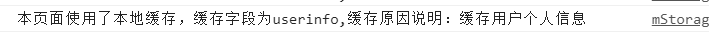

<!--
 * @Description: 
 * @version: 
 * @Author: lxw
 * @Date: 2020-05-03 18:31:38
 * @LastEditors: lxw
 * @LastEditTime: 2020-05-04 22:00:59
 -->
#### 封装基于localStorage的数据持久化方案
> 业务项目数据持久化封装，对于多离线缓存页面的项目提高数据缓存编码效率以及可维护性

#### 两个版本
1. 非模块化的，仅仅支持script导入，`lib\noneModuleStorage.js`
2. 模块化，`lib\mStorage.js`

#### 功能
1. 提供一个集中管理应用缓存的对象，自己根据项目需要创建该对象后通过构造函数传入插件
2. 插件对封装对象的属性进行监听，实现属性的响应式，以此实现自动缓存
3. 可以使用对象'.'语法来操作每一个属性的缓存设置和获取，同时不用考虑对象类型格式的转换
> 比如我们想要存储一个数组，直接使用localStorage.setItem(ary,[1,2,3,4]),返回给我们的是字符串'1,2,3,4'，我们就得自己去做格式转换。
4. 提供设置缓存过期时间，通过配置参数可以设置字段缓存的有效时间，比如30天，获取缓存过程中如果缓存过期会触发then实例方法的第一个参数回调函数通知缓存过期，可以在触发的回调函数里面重新获取和设置新的内容
5. 缓存异常的捕获，捕获到错误默认不处理，触发then()方法第二个参数函数暴露给用户自己处理
关于4与5的演示
```js
// 提示：在获取缓存内容的时候需要先显示判断注册回调函数监听缓存是否过期，否则会报错,第一个参数
        // 第二个参数可选：监听异常错误，如果缓存出现了异常错误，比如缓存已经满了
        storage.then((key) => {
            // 缓存失效处理
            alert(`监听到缓存字段${key}已经失效了`)
            // 重新获取和设置key内容
        }, (err) => {
            // 缓存出现了异常处理
            if (err.name == 'QuotaExceededError') {
                console.log('已经超出本地存储限定大小！');
                // 可进行超出限定大小之后的操作，如下面可以先清除记录，再次保存
                // localStorage.clear();
                // localStorage.setItem(key,value);
            }
        })
```

#### 具体使用，看下面的例子，或者是项目中给出的例子

##### 使用--两种类型一种是es6模块化的，一种是script脚本引入的非模块化的
 说明

模块化使用
需要创建一个生命周期贯穿整个应用的全局缓存实例，推荐使用模块化语法，封装一个配置文件，导入相关模块
例子，storage.js
```js
/*
 * @Description: 
 * @version: 
 * @Author: lxw
 * @Date: 2020-05-03 20:27:13
 * @LastEditors: lxw
 * @LastEditTime: 2020-05-03 22:29:44
 */
import Storage from '../lib/mStorage';


// 建立一个存放需要持久化(即缓存的信息字段)字段的封装对象
const appStorageData = {
    version:'1.0',
    userinfo:'暂无',
    theme:'blue',
    userPlaninfo:{
        key1:'fsdfjslfs',
        key2:'fsfdsf'
    }
}

// 对localStorage进行配置，比如配置缓存有效时间
let localStorageConfiguration = {}

 // 传入封装持久化字段的对象初始
 // 会对传入的对象参数的每一个属性注册监听get与set，
 // 主要此时不会被执行持久化操作，需要某个字段内容被持久化，需要手动设置属性值。比如 appStorageData.version = xxx 才会触发持久化操作
let storage = new Storage(appStorageData,localStorageConfiguration)

// 为字段配置缓存说明,默认为无，可以根据需要配置
 // 添加缓存说明，比如userPlaninfo缓存的是用户个人计划
// 第一个参数kye要与对应缓存字段key一致
storage.addReason('userinfo','缓存用户个人信息')
storage.addReason('userPlaninfo','缓存用户个人计划')


// 设置
appStorageData.userinfo = '我叫xxxx'
// 可以直接传递对象类型进行缓存
appStorageData.userinfo = {
    name:'lxw',
    age:23,
    hobbies:['篮球','编程','小说','游戏',],
    introduce:'乘风破浪会有时，直挂云帆济沧海'
}
 
```
导入配置模块api，使用：
```html
<!DOCTYPE html>
<html lang="en">
<head>
    <meta charset="UTF-8">
    <meta name="viewport" content="width=device-width, initial-scale=1.0">
    <meta http-equiv="X-UA-Compatible" content="ie=edge">
    <title>测试</title>
</head>
<body>
    


<script>

       import { cachData, storage } from "./storage.js"

        // 提示：在获取缓存内容的时候需要先显示判断注册回调函数监听缓存是否过期，否则会报错
        storage.expTime((key) => {
            // 缓存失效处理
            alert(`监听到缓存字段${key}已经失效了`)
            // 重新获取和设置key内容
        })

        // 获取需要字段的缓存内容,同一个字段建议一次性取了，否则会重复触发缓存字段
        let userInfo = appStorageData.userinfo


        // 获取
        // 获取操作是直接通过我们封装缓存字段的对象来实现的
        // 设置后可以在其他页面，导入封装对象，使用对象语法来直接获取
        console.log(userInfo);
        console.log(userInfo.introduce)

</script>

</body>
</html>
```

效果


非模块化使用
非模块化仅仅是支持script导入，可以在目录`./test-none-module/`实例，查看如何实现单个实例管理多个html
> 由于是不支持模块化版本，无法利用模块依赖导入创建一个`Storage`对象的全局的配置文件
> 一个html文件，需要创建一个新的`Storage`实例，以及封装缓存字段的对象
> 由于缓存字段属于app全局的，所以可以创建一个封装缓存字段的模板js文件，方便维护，具体实例，看`./test-none-module/`

#### 待完善
- 针对某一个字段设置具体的缓存有效时间
- 清空缓存
- 清楚某个字段的缓存

